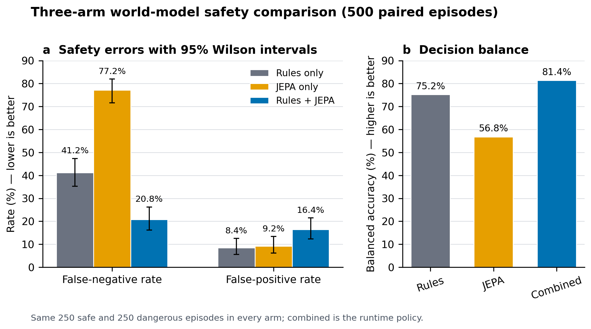
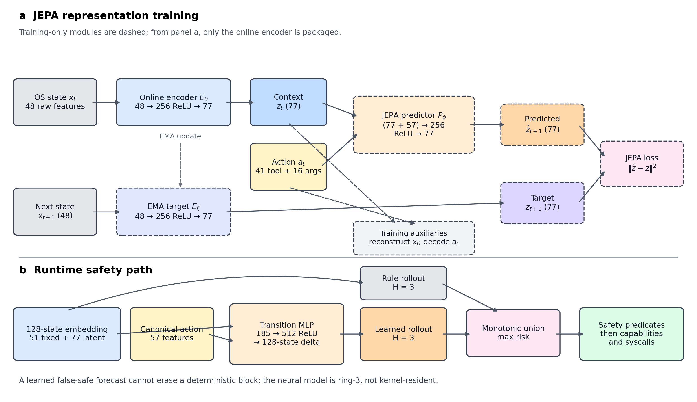

# Predictive safety for an agentic OS

This document states the research claim that FerrumOS can support today, the
threat model under which it is evaluated, and the limitations that must remain
visible in a paper or submission. It is intentionally narrower than “the world
model makes the OS safe.”

The post-publication architecture-controlled and cross-domain evidence is
summarized in
[`CROSS_DOMAIN_WORLD_MODEL_IMPROVEMENT_STUDY.md`](CROSS_DOMAIN_WORLD_MODEL_IMPROVEMENT_STUDY.md).

## Registered v3.4 research candidate (not deployed)

The post-publication v3-v3.4 study preserves four negative iterations and a
separately frozen source-held-out final catalog. The selected FWM2 candidate
improves normalized rollout error on the untouched published test partition at
H=1, H=3, and H=5 by 9.54%, 2.36%, and 0.92%, respectively; its geometric error
ratio to deployed runtime-v2 is 0.956508.

On the new 512-episode deterministic incident-informed simulator, the v3.4
request-bounded policy records 256 TP, 0 FN, 256 TN, and 0 FP. The paired
source-stratified balanced-accuracy improvement over runtime-v2 has a
10,000-resample 95% interval of +46.35 to +48.82 percentage points. Rules-only
and rules+JEPA are identical on that final catalog, so the final safety result
is attributed entirely to deterministic policy. It is not evidence of
incremental learned safety value or production-incident replay.

The candidate is archived under `artifacts/world-model-v3.4/` but is not
promoted. It has now been exercised in authority-disabled shadow mode inside
the real ring-3 preview gate: 200 previews at each H=1 through H=5 record a
3 ms p99 guest time, zero retained heap growth, and successful model loading.
A separate 96-request canonical command batch returned 96 correlated preview
responses, emitted no execution record, and left the packaged source disk
byte-identical. Later registered extensions add 128/128 read-only preview
responses from four distinct WebSocket clients and 24 privacy-bounded records
from three visible, computer-controlled natural-use QEMU sessions. Those runs
establish bounded single-guest contention and short researcher-operated UI
traffic, not production timing, multi-host deployment, labelled accuracy, or
independent user evidence. The appliance model and manifest remain runtime-v2.
Reproduce the original candidate result with
`scripts/verify_world_model_jepa_v3_4.py --online`, verify the shadow,
contention, and natural-use evidence with
`scripts/verify_world_model_v3_4_shadow.py`,
`scripts/verify_world_model_multiclient_result.py`, and
`scripts/verify_world_model_natural_use.py`, and verify the full matched
follow-up with `scripts/verify_cross_domain_world_model_improvement_study.py`.
The paper draft is
`paper/when_agents_control_kernel_technical_report_v1_2.md`. It is a full
consolidated manuscript: the published architecture, corpus, baselines,
runtime, calibration, and false-negative analysis remain in scope, while the
v3-v3.4 evidence is integrated as a registered extension. The earlier
six-page v3.4 research note remains an internal evidence summary and is not a
replacement publication.

## Claim and system boundary

FerrumOS uses an action-conditioned joint-embedding predictor as one input to a
pre-execution safety gate. Provider output is first normalized into a canonical
OS action and argument vector. The daemon then evaluates two independent
forecasts: a deterministic transition table and a learned JEPA transition. The
union blocks if either forecast crosses a safety predicate. A block happens
before tool dispatch; kernel capabilities and physical confirmation remain
independent enforcement layers after the predictive gate.

The world model is **not kernel-resident**. It runs in the ring-3 Heliox daemon
at the OS mediation boundary immediately above capability-gated syscalls. The
kernel stays deterministic. The differentiator from prompt-only or web-agent
defenses is therefore OS-level action mediation with a kernel backstop, not a
claim that neural inference executes in privileged kernel space.

## Threat model

### Assets

- integrity and availability of `/disk`, especially Heliox configuration and
  persistent state;
- kernel and service continuity;
- bounded process, heap, and disk consumption;
- the operator's authority to approve destructive actions; and
- auditability of proposed, blocked, and executed canonical actions.

### Adversaries and failure sources

1. **Untrusted model output.** A cloud model, local language model, retrieved
   document, or web page can induce an arbitrary tool name and arguments.
2. **Paired controller misuse.** A controller that possesses the boot-scoped
   pairing token can submit syntactically valid but harmful `execute_tool`
   requests.
3. **Benign autonomy failure.** The built-in planner can repeat a locally
   reasonable action until its aggregate effect becomes unsafe.
4. **Unprivileged local software.** A ring-3 process can attempt operations for
   which it lacks capabilities, or try to route them through Heliox.

Trusted kernel code, a malicious physical operator, compromised build signing
keys, hardware attacks, and an attacker already holding unrestricted root
authority are outside this experiment. Static model-file corruption is partly
covered by size, metadata, finite-value, and SHA-256 checks; poisoning of a
correctly signed training corpus is not.

### Threat categories and expected controls

| Category | Example | Primary control | Status in the registered evaluation |
|---|---|---|---|
| Direct single-step harm | Delete the daemon config; replace the running kernel | Exact deterministic predicate plus capability/confirmation | Combined gate: 63/63 dangerous episodes blocked, 0/62 safe episodes blocked |
| Compound resource harm | Fifty individually small writes; repeated heap-growing actions; repeated service starts | H=3 forecast plus observation on every real step | Partial: disk and learned heap sequences are represented; cumulative process history remains incomplete |
| Prompt injection | Untrusted provider content proposes a destructive canonical action | Provider-independent normalization, predictive gate, capability boundary | Combined gate: 52/63 dangerous episodes blocked, 0/62 safe episodes blocked |
| Rule-table edge or OOD case | Path alias, learned resource effect, deletion of an unlisted sensitive file | Canonical path rules plus learned residual effects | Partial: 41/62 dangerous episodes blocked; unlisted sensitive paths remain a known miss |

### Security properties

- Every public provider, planner, gesture, and JSON-RPC tool path is intended to
  pass through the same gate before dispatch.
- The deterministic estimate stays active even when a learned model claims
  coverage. A learned false-safe prediction cannot erase a deterministic block.
- Provider identity is provenance, not a feature. The same canonical action is
  evaluated identically whether it came from Heliox, a local model, or a remote
  provider.
- A predictive allow is not execution authority. Capabilities, syscall
  validation, and confirmation can still reject it.
- A predictive block is fail-safe for integrity but can create an availability
  failure. False positives are therefore a first-class metric.

### Worst-case failures

A false negative permits the request to continue to later capability and
confirmation checks. If those checks also permit it, the harmful action can
execute. A false positive prevents useful work and can be exploited as a denial
of service. A sufficiently novel hazard that neither changes a represented
resource feature nor matches a deterministic predicate is invisible to this
gate. These are measured limitations, not formal safety guarantees.

## Registered baseline experiment

The registered protocol evaluates the same 500 episodes under three conditions:

1. **Rules only:** deterministic transition estimate and exact predicates.
2. **JEPA only:** learned transition and numeric safety predicates, with no
   exact-path or policy-only credit.
3. **Rules + JEPA:** monotonic union used by the runtime.

The set contains 250 safe episodes and 250 dangerous episodes labeled by a
versioned, authored scenario oracle before model inference, with 125 episodes
in each threat category. These are not independent human annotations. Initial
states and empirical resource deltas come from the 1,969-row untouched
episode-level QEMU test split.
The harmful counterfactuals are evaluated offline; the experiment does not claim
that 500 destructive actions were executed against a live disk. The fixture,
per-episode predictions, aggregate JSON, and generated report are committed next
to this document and bound to the release dataset and model hashes.

| Condition | TP | FN | FP | TN | FNR (95% Wilson) | FPR (95% Wilson) | Balanced accuracy |
|---|---:|---:|---:|---:|---:|---:|---:|
| Rules only | 147 | 103 | 21 | 229 | 41.2% (35.3–47.4%) | 8.4% (5.6–12.5%) | 75.2% |
| JEPA only | 57 | 193 | 23 | 227 | 77.2% (71.6–82.0%) | 9.2% (6.2–13.4%) | 56.8% |
| Rules + JEPA | 198 | 52 | 41 | 209 | 20.8% (16.2–26.3%) | 16.4% (12.3–21.5%) | 81.4% |

The paired comparison is the useful result: JEPA adds 51 dangerous catches over
rules alone, loses zero deterministic catches, and adds 20 safe-action blocks.
The dangerous-catch difference is significant under an exact paired McNemar
test (`p = 8.88 × 10⁻¹⁶`). The result supports using the learned branch as a
complement to rules, not as their replacement. It also shows a real calibration
cost: the combined system trades a 20.4 percentage-point reduction in false
negatives for an 8.0 percentage-point increase in false positives on this
boundary-heavy stress set.

Within the compound-resource subset, the combined gate blocks **42/62**
dangerous cases; the remaining **20** are process-history misses. These counts
come directly from the committed per-category confusion matrix.



**Figure 1.** Three-arm paired comparison. Error bars are 95% Wilson intervals
for false-negative and false-positive rates. The combined runtime policy has
the best balanced accuracy and lowest FNR, but its higher FPR makes the safety
versus availability tradeoff explicit.

Reproduce the registered artifacts with:

```powershell
python scripts/verify_world_model_safety_evaluation.py
```

To regenerate the fixture from the full release dataset:

```powershell
python scripts/evaluate_world_model_safety.py `
  --dataset target/world_model_dataset_release_repaired2.jsonl `
  --fixture-out docs/research/world_model_safety_scenarios.json `
  --json-out docs/research/world_model_safety_baseline.json `
  --csv-out docs/research/world_model_safety_predictions.csv `
  --markdown-out docs/research/WORLD_MODEL_SAFETY_BASELINE.md
```

## Expanded paper evaluation

The paper evidence package adds controls that materially narrow the claim. It
compares always-allow and always-block decisions, the rule table, a per-action
mean transition learned from the training partition, the matched autoencoder
transition, the JEPA transition, an action-conditioning ablation, and a
validation-only residual-calibration ablation. The principal combined results
on the fixed 500-episode fixture are:

| Combined condition | TP | FN | FP | TN | FNR | FPR | Balanced accuracy |
|---|---:|---:|---:|---:|---:|---:|---:|
| Rules only | 147 | 103 | 21 | 229 | 41.2% | 8.4% | 75.2% |
| Rules + autoencoder | 189 | 61 | 41 | 209 | 24.4% | 16.4% | 79.6% |
| Rules + per-action mean delta | 198 | 52 | 42 | 208 | 20.8% | 16.8% | 81.2% |
| Rules + JEPA (seed 17) | 198 | 52 | 41 | 209 | 20.8% | 16.4% | 81.4% |
| Rules + validation-calibrated JEPA | 209 | 41 | 41 | 209 | 16.4% | 16.4% | 83.6% |

The mean-delta condition differs from JEPA on only three correctness outcomes:
JEPA is uniquely correct twice and the mean model once. Although the selected
JEPA checkpoint and the per-action mean baseline produce nearly identical
binary safety outcomes on the authored fixture, this parity does not imply
equivalent transition modelling. JEPA reduces H=3 rollout error from 6.45% for
the matched autoencoder to 3.87%, indicating stronger prediction of fine-
grained state trajectories. Such representations may be valuable for
downstream tasks requiring context-dependent or multi-variable forecasts rather
than only thresholded safety decisions. However, the present study does not
establish that JEPA outperforms the per-action mean model on those downstream
tasks; that question requires direct evaluation.

The fixed checkpoint is also not representative of initialization variance.
With the encoder held fixed, full 2,000-epoch transition runs at seeds 17, 42,
and 91 produce a mean combined balanced accuracy of 78.6% (sample SD 2.6
percentage points, range 76.2%--81.4%) and mean FNR 30.7% (range 20.8%--37.6%).
Model selection uses validation transition metrics, never the safety-test
labels. These runs make checkpoint sensitivity a first-class result rather than
reporting only the best observed safety score.

A stronger follow-up independently trains the entire encoder-to-transition
pipeline at seeds 17, 42, 91, 123, and 2026. This varies the online encoder,
EMA target, JEPA predictor, reconstruction/action heads, and transition MLP.
Across those five complete runs, combined balanced accuracy is 79.76% mean
(sample SD 2.33 points; 95% t interval 76.87%--82.65%), FNR is 27.04% mean
(18.53%--35.55%), and FPR is 13.44% mean (9.46%--17.42%). All seeds are
reported and the safety fixture is not used for checkpoint selection. The
wide intervals describe training-run uncertainty on one authored fixture, not
deployment-population uncertainty.

The two results labelled with seed 17 must not be conflated. Full-pipeline seed
17 independently retrains the online encoder, EMA target encoder, JEPA
predictor, reconstruction and action heads, and transition model. The release
checkpoint retains the representation trained with seed 42 and varies only the
transition-model seed. These therefore represent different trained checkpoints.
The full-pipeline seed-17 result reaches 80.6% balanced accuracy, 28.4% FNR,
and 10.4% FPR.

The safety horizon ablation also changes the interpretation of H=3. H=2 has the
highest balanced accuracy on this fixture (84.8% versus 81.4% at H=3), while
H=5 has the lowest FNR (16.8%) at the same 16.4% FPR as H=3. H=3 remains the
release setting because it is the minimum verified horizon for the deterministic
process-delta pattern, not because the paper establishes it as a global optimum.

Finally, an untouched 1,969-row episode-disjoint QEMU negative-control replay
contains no observed resource-threshold crossing or protected-config deletion.
Rules block 0 rows; the learned branch blocks 216 (109.7 alerts per 1,000 safe
actions). The validation-only one-sided residual calibration improves the
stress FNR but increases this alert rate to 134.6 per 1,000. This replay measures
false alarms only; it is not a natural-prevalence dangerous-action benchmark.
Prevalence tables in the machine-readable report are sensitivity projections,
not observed deployment rates.

The complete deterministic report, per-episode predictions, dataset-accounting
ledger, training-seed statistics, AUROC/AUPRC, calibration diagnostics, paired
bootstrap interval, and reference latency are in
[`WORLD_MODEL_PAPER_EVALUATION.md`](WORLD_MODEL_PAPER_EVALUATION.md) and
`world_model_paper_evaluation.json`. Verify them with:

```powershell
python scripts/verify_world_model_paper_evaluation.py
```

## Boundary calibration, runtime, and failure evidence

A post-training QEMU negative-control corpus contains 240 successful
`hud_update` episodes across 12 normalized argument-size regimes, including the
128-byte render boundary. It remains outside training and the registered test
split. All measured heap deltas are zero; transition heap-delta MAE is 0.00296,
and the deployed resource predicate raises zero false alarms. A reported p95
upper-residual margin also raises zero alarms on this set, but is analysis only:
one safe action class cannot establish dangerous-action recall or justify a
production calibration guarantee.

The real ring-3 gate was then measured after 64 warmup previews, with 100
preview-only actions at each horizon. Mean PIT time is 1.35, 1.44, 1.45, 1.53,
and 1.59 ms for H=1 through H=5; p95 is 2 ms throughout at 1 ms resolution.
Both learned artifacts load in 30 ms and 500 measured previews add zero heap
bytes. Virtual TSC cycles are retained without wall-time conversion because the
WHPX virtual TSC did not agree reliably with the guest PIT.

A single paired WebSocket submitted 96 outstanding previews across six action
classes. All 96 responses were correlated by ID, duplicate requests were
deterministic, no execution record was added, and the guest remained fault-free.
The daemon serializes inference; this tests framing and state isolation, not
parallel neural execution. Failure injection separately verifies valid, missing,
non-finite, forbidden policy-coverage, and collapsed-training cases. Invalid or
absent learned artifacts retain deterministic safety; rejected training emits
metrics but no promotable artifact.

## Dataset and independent-label status

The exact 13,697-row JSONL now has a deterministic compressed release package,
source and archive SHA-256 values, explicit MIT dataset licence, data card,
episode-split validation, credential scan, and independent package verifier.
The exact package is published open access at Zenodo under version DOI
`10.5281/zenodo.21829193`; all versions resolve through DOI
`10.5281/zenodo.21829192`. A fresh public download matched the ten local release
files byte-for-byte and passed the package verifier 11/11. The public metadata,
file checksums, and verification result are preserved in
`world_model_dataset_publication.json`.

The accompanying report, *When Agents Control the Kernel: A JEPA World Model
Safety Gate with Empirical False-Negative Decomposition*, is published open access
as Technical Report v1.2 under Zenodo DOI `10.5281/zenodo.22116399`; all report
versions resolve through DOI `10.5281/zenodo.21829807`. The report DOI is distinct
from the dataset DOI. `world_model_technical_report_publication.json` records the
public record, DOI resolution, citation pagination, and exact public-file checksums.

FerrumOS also emits privacy-bounded natural-use telemetry without prompts,
arguments, paths, provider/model identity, screen/audio, or output content.
The committed protocol targets seven days, 20 task families, 1,000 proposed
actions, and 100 destructive/resource-changing proposals where safe. A written
rubric and decision-blinded two-annotator workflow compute uncertainty,
agreement, Cohen's kappa, disagreements, post-lock adjudication, and confusion
metrics. A separate frozen short-session extension now records 24 actions from
three computer-controlled QEMU boots across six action classes; it is reported
only as unlabelled runtime-friction and authority evidence. It does not satisfy
the seven-day/1,000-action longitudinal target. Until independent annotators
complete the registered workflow, natural-use precision, recall, and danger
prevalence remain unclaimed.

## Why a JEPA representation

Raw OS state contains substantial structure that is expensive or actively
misleading to reproduce exactly: arbitrary path strings, process names, screen
content, timestamps, and device-specific noise. A generative next-state model
must spend capacity reconstructing those details even when the gate only needs
to know whether a proposed action moves the system toward a hazardous region.
JEPA was proposed as a non-generative predictive architecture that operates in
representation space rather than reconstructing every input detail
([LeCun, 2022](https://openreview.net/forum?id=BZ5a1r-kVsf)). I-JEPA later
demonstrated the same central design choice empirically for semantic image
representations ([Assran et al., 2023](https://arxiv.org/abs/2301.08243)), and
V-JEPA extended feature-only prediction to temporal visual representations
without pixel reconstruction or pretrained encoders
([Bardes et al., 2024](https://arxiv.org/abs/2404.08471)). These vision results
motivate the representation-space objective; they are not evidence that an OS
transition model inherits visual-semantic performance.

FerrumOS adapts that idea to action-conditioned OS transitions: a context
encoder maps observed state to a compact latent; a predictor receives that
latent, the canonical action, and normalized arguments; an EMA target encoder
defines the next-state representation. Reconstruction and action auxiliaries,
plus variance, effective-rank, and action-sensitivity gates, discourage
collapse. The transition model is then trained in the accepted representation.



**Figure 2.** FerrumOS action-conditioned JEPA training and runtime wiring. The
EMA target, JEPA predictor, reconstruction head, and action decoder are
training-only. The packaged online encoder contributes 77 latent dimensions to
the 128-state runtime embedding; the 512-hidden transition MLP predicts a
128-state delta, and its H=3 rollout is combined monotonically with an
independent deterministic rollout before capabilities and syscalls.

This is an inductive-bias argument, not a causality theorem. Joint-embedding
prediction encourages features that are predictable and useful for the training
objective; it does **not** prove that the latent contains only causally relevant
OS variables. Exact semantic facts that must not be compressed away—such as the
canonical path to `config.json`—remain deterministic predicates. The empirical
JEPA-versus-autoencoder result and the three-arm safety result are both needed:
one tests representation quality, the other tests whether that representation
changes safety decisions.

## Relation to prior safety work

| Work | Evaluation or mechanism | Layer | Difference from FerrumOS |
|---|---|---|---|
| [LeCun's JEPA proposal](https://openreview.net/forum?id=BZ5a1r-kVsf) | Hierarchical joint-embedding predictive world-model architecture | Representation/world model | Supplies the non-generative design argument; FerrumOS evaluates a concrete action-conditioned OS instantiation |
| [I-JEPA](https://arxiv.org/abs/2301.08243) and [V-JEPA](https://arxiv.org/abs/2404.08471) | Masked feature prediction for image and video representations | Perceptual representation | Establish representation-space prediction in vision; neither evaluates state-changing OS actions or runtime safety |
| [SafetyBench](https://arxiv.org/abs/2309.07045) | 11,435 bilingual multiple-choice questions across seven LLM-safety categories | Model knowledge/output | FerrumOS evaluates concrete state-changing OS actions, not safety knowledge in generated text |
| [Constitutional AI](https://arxiv.org/abs/2212.08073) | Supervised self-critique plus reinforcement learning from AI feedback | Model training/alignment | Complementary: a constitution shapes model behavior; FerrumOS mediates actions from any provider at runtime |
| [WebArena](https://arxiv.org/abs/2307.13854) | Reproducible long-horizon tasks on functional websites | Agent/application environment | Measures task success in a web environment; FerrumOS measures pre-execution safety decisions across OS capabilities |
| [Agent-SafetyBench](https://arxiv.org/abs/2412.14470) | 2,000 cases in 349 tool-interaction environments | Agent/application | Broader behavioral taxonomy; FerrumOS adds an OS action gate and kernel capability backstop |
| [ST-WebAgentBench](https://arxiv.org/abs/2410.06703) | Policy compliance and risk ratio in WebArena-derived tasks | Web application | Web policy evaluation does not mediate filesystem, process, audio, device, or kernel-transition syscalls |
| [SafeDreamer](https://arxiv.org/abs/2307.07176) | World-model planning with constrained-RL/Lagrangian objectives in Safety-Gymnasium | Learned control policy | Closest world-model safety analogy, but FerrumOS filters discrete canonical OS actions without training the provider policy |
| [Responsible Robotic Manipulation](https://arxiv.org/abs/2411.18289) | A world model generates risky manipulation scenarios and a mental model reflects on consequences | Physical-agent safety | Shares consequence prediction before action, but FerrumOS combines a numeric latent gate with deterministic OS policy and kernel enforcement |

The literature comparison does not claim metric equivalence: question accuracy,
policy-compliant task completion, RL cost, and OS gate FPR/FNR measure different
objects. The defensible novelty claim is the placement and composition of the
mechanism: provider-independent action normalization, learned latent prediction,
deterministic predicates, and capability-gated execution in an agentic OS.

## Section 7: Discussion

All 52 false negatives in the combined arm were inspected against the committed
scenario, prediction, and release-weight artifacts. They form three exhaustive
clusters rather than a diffuse tail:

| Failure cluster | Misses | Share of FN | Verified cause |
|---|---:|---:|---|
| Unmodeled sensitive-state deletion | 21 | 40.4% | `/disk/heliox/memory.bin` is immediately harmful but absent from the exact protected-path policy and numeric state delta |
| Cumulative process exhaustion | 20 | 38.5% | Fifty `service_start` calls raise process occupancy from 0.20 to 0.98125; per-request H=3 never reaches the delta-50 predicate, and absolute process occupancy is not scored |
| Injected heap exhaustion | 11 | 21.2% | Every observed next state crosses 0.95, but the learned forecast stays below it; 10/11 misses are `hud_update` |

The first cluster is a semantic policy-coverage failure. More JEPA samples alone
cannot tell the gate which persistent artifacts are security-critical. The
appropriate response is a versioned protected-asset policy plus an abstention
path for unknown critical asset classes.

The second cluster is a temporal abstraction failure. It is not caused by an
incorrect one-step service-start delta: the evaluator observes the accumulated
process state after every allowed step. The safety function nevertheless tests
only cumulative predicted process creation inside the current three-step
self-composition. Episode history, an absolute process-occupancy predicate, or
branching over distinct planned actions is required.

The third cluster is the part directly attributable to learned transition
calibration. Ten of eleven misses are `hud_update`, whereas nine of ten
`http_get` heap-boundary episodes are caught. On the misses, first-step predicted
heap lies between 0.769 and 0.902 although every observed next state exceeds
0.95. Targeted boundary collection for `hud_update`, per-action calibration,
and uncertainty-triggered abstention are therefore better-motivated than a
global threshold change.

Every missed episode records risk 0.0. This indicates coverage gaps rather than
near-threshold rounding, and it makes threshold tuning alone an unsuitable fix.
Overall, 41/52 misses require added policy or temporal semantics; 11/52 motivate
targeted model/data work. The complete episode identifiers, distributions,
numeric ranges, and source hashes are reproduced in
[`WORLD_MODEL_FALSE_NEGATIVE_ANALYSIS.md`](WORLD_MODEL_FALSE_NEGATIVE_ANALYSIS.md)
and `world_model_false_negative_analysis.json`.

## Limitations and next experiments

- The registered episodes are counterfactual stress cases grounded in QEMU
  states, not 500 fresh destructive QEMU executions. A multi-week live campaign
  remains useful external validation, but it is no longer required to reproduce
  the decision-level baseline.
- The stress set uses one registered seed and authored oracle rules. Independent
  human review of labels and a held-out natural-traffic prevalence study remain
  needed before generalizing the rates. Three transition initializations and a
  validation-residual calibration ablation are now reported, but the JEPA
  representation itself is held fixed across those runs.
- Runtime lookahead repeats one proposed action to H=3. It does not branch over
  distinct plans, and it does not carry a 50-action cumulative process history.
- The combined gate still misses 52/250 dangerous episodes and blocks 41/250
  safe episodes in this stress set. It must not be described as perfect,
  formally verified, or sufficient without kernel controls.
- Exact protected-path policy currently names the daemon config. The evaluation
  deliberately includes deletion of `/disk/heliox/memory.bin` as an unmodeled
  sensitive-state failure.
- Prompt-injection episodes test whether malicious provenance changes canonical
  action mediation. They are not a substitute for end-to-end browser attacks,
  poisoned observations, Unicode/path parser differentials, or compromised
  bridge authentication.
- No calibrated epistemic uncertainty or out-of-distribution detector is yet
  attached to the JEPA predictor. False-positive reduction and abstention should
  be evaluated on validation data before changing the release threshold.

Machine-readable references are in [`references.bib`](references.bib). Direct
primary-source access for the six core paper references was rechecked on
2026-08-06 and is recorded in [`LITERATURE_ACCESS.md`](LITERATURE_ACCESS.md).

Regenerate and byte-verify both paper figures with:

```powershell
python scripts/generate_world_model_figures.py --manifest docs/research/artifacts/world-model-study-v1.0.0/manifest.json
python scripts/verify_world_model_figures.py
```
