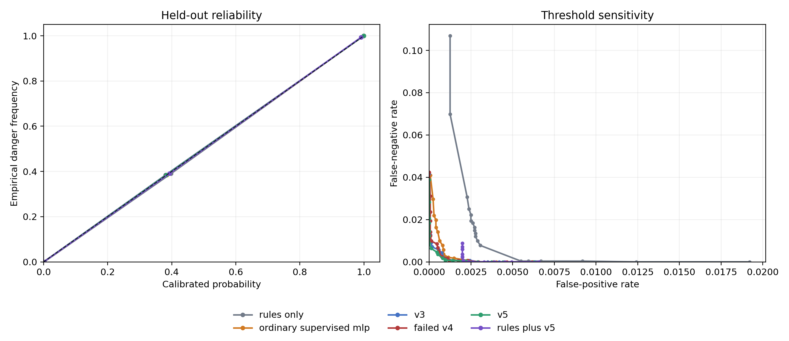
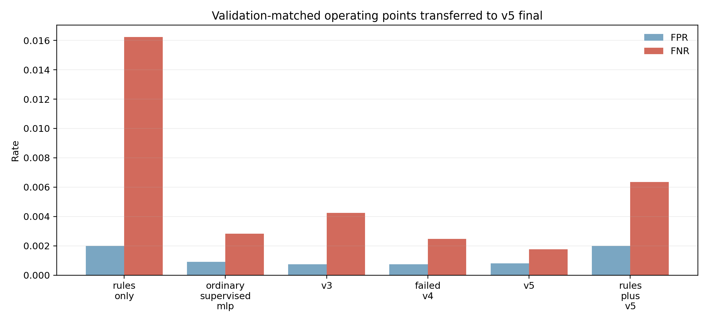

# Learned Caution, Deterministic Authority

## A Calibration-First Runtime Boundary for Action-Conditioned Latent World Models in Cyber-Physical Systems

Vyom Kulshrestha

Independent Researcher, India

github.com/VyomKulshrestha/Ferrum-OS | vyomkulshrestha2004@gmail.com

Technical Report v1.1 - 25 August 2026

### Abstract

Learned world models can predict unsafe consequences before an action executes, but prediction quality is not authority. This paper presents a small action-conditioned joint-embedding predictive architecture (JEPA) integrated as a caution-only component in a cyber-physical runtime: the learned model may reject or escalate an action, while deterministic rules, confirmation provenance, replay protection, deadlines, and a digest-bound command bridge retain all authority to permit delivery. The empirical study preserves a complete model lineage, including a failed v4 checkpoint, and uses a validation-only v5 selection over 30 candidates followed by one frozen final evaluation. On 20,480 source-informed deterministic-simulator transitions from eight held-out incident families, v5 reduces normalized H=3 rollout error from 0.007515 to 0.003560 and the geometric H1/H3/H5 error ratio to 0.4842. At a false-positive operating point selected on a separate validation partition, learned-only v5 records 5 false negatives and 14 false positives on the final set, with ECE 0.000443 and Brier score 0.000827. A fixed-rules-plus-v5 union reduces rules-only false negatives from 46 to 18 without increasing its final false-positive count of 35. A new selection-blinded 512-case PyBullet DIRECT benchmark records 429 completed tasks (83.79%), 83 interventions (16.21%), 79 unshielded collisions, and zero shielded collisions. The deterministic rule accounts for all observed collision avoidance; v5 adds three conservative stops and no incremental collision avoidance on that benchmark. A preregistered first attempt that failed completion is retained. The contribution is a reproducible safety-runtime and systems result, not a robotics-deployment or safety-guarantee claim.

### 1. Introduction

An agent that can control a kernel, a browser, or a machine adapter creates the same architectural problem in different clothes: a probabilistic component proposes or predicts, but a small trusted boundary must decide what the system is authorized to do. In physical systems the cost of confusing those roles is unusually high. A well-ranked prediction can still be miscalibrated, a model update can silently change a decision surface, and a transport acknowledgement can be mistaken for evidence that an actuator executed safely.

Recent world models show that action-conditioned latent prediction can support planning. V-JEPA 2-AC predicts future visual representations conditioned on robot actions and plans on real Franka arms [1]; DINO-WM predicts in a pretrained visual feature space and performs zero-shot planning [2]. Recent predictive-safety work makes calibration and deterministic shielding explicit [3]. Runtime-assurance research, meanwhile, treats an advanced component as untrusted and preserves a trusted reversionary path [4,5]. Our question is narrower and more systems-oriented:

> Can a compact learned world model add useful caution inside a capability- and provenance-aware runtime without ever acquiring authority to permit a physical command?

We study that question in FerrumOS using a 16-dimensional physical state, seven actions, and three action features. The learned artifact predicts the next state in a latent space and a deterministic decoder maps that representation back to state deltas. Runtime predicates inspect predicted clearance, motion near humans, geofence margin, battery, link health, emergency-stop state, and repair approval. Crucially, the learned path is monotone with respect to authority: it may add a block, but it cannot remove a deterministic block, mint confirmation, extend a deadline, bypass replay protection, or invoke an adapter.

The paper makes four contributions:

1. A concrete authority factorization for learned prediction in a cyber-physical runtime, including digest binding, canonical command envelopes, confirmation provenance, deadlines, replay protection, and fail-closed delivery states.
2. A frozen model-selection lineage in which v3 remains the baseline, v4 is retained as a negative result, and v5 changes only the decoder while keeping encoder and predictor parameters fixed.
3. A post-hoc, separately registered matched-FPR and calibration study over rules-only, a supervised MLP, v3, failed v4, v5, and rules+v5, with reliability curves, ECE, Brier score, threshold sensitivity, and reviewer-requested uncertainty analysis.
4. An integration executed through the third-party PyBullet physics engine, with every observation explicitly labelled simulated and physical actuator authority disabled.

We do not claim a learned safety guarantee, physical deployment, HIL validation, real-time behavior, certification, or independent assessment. Public incident reports provide defensive state-distribution priors; they are not Ferrum trajectories. Every training and final label in the main model study is generated by a deterministic simulator.

### 2. Related Work

#### 2.1 Latent world models

JEPA-style models predict representations rather than pixels, aiming to preserve predictable structure while ignoring irrelevant detail. V-JEPA 2 scales this approach to video and adds an action-conditioned predictor for robot planning [1]. DINO-WM instead predicts frozen DINOv2 features and demonstrates planning across several simulated environments [2]. These systems establish latent prediction as a practical interface for planning, but they do not by themselves define an operating-system authority boundary.

Our model is intentionally much smaller and state-based. Its research value is not scale. It is the controlled lineage and the surrounding runtime contract: a fixed binary artifact format, deterministic state predicates, a digest-bound session, and a command bridge that treats uncertain delivery as non-repeatable without reconciliation.

#### 2.2 Calibration and predictive screening

Neural classifiers can be accurate yet poorly calibrated [6]. Brier score measures the squared error of probabilistic predictions [7], while expected calibration error summarizes the gap between confidence and empirical frequency. Calibrated Predictive Safety combines action-conditioned JEPA scoring with a hard model-based shield and makes calibration a first-class evaluation target [3]. Its closest conceptual overlap with this work is deliberate: both separate learned estimates from deterministic admissibility. Our distinction is a systems one. We place the separation at a capability-aware runtime and canonical bridge, preserve failed artifact lineage, and measure digest and deployment immutability. We make no priority claim over calibrated learned shielding.

#### 2.3 Runtime assurance and safety architectures

Simplex and runtime-assurance architectures allow an advanced, potentially unverified component to operate only while a trusted monitor and fallback preserve a safety property [4,5]. Neural Simplex extends this pattern to learning-enabled control [8]. SHIELD combines learned dynamics residuals with stochastic control-barrier constraints on humanoid hardware [9]. Those works motivate a hard separation between learning and safety authority. Our implementation is less ambitious in control theory and physical evidence, but more explicit about software provenance: confirmations, artifact digests, idempotency keys, source clocks, run epochs, deadlines, and delivery uncertainty are part of the trusted boundary.

### 3. System and Threat Model

#### 3.1 State and action model

The simulator state contains position `(x,y)`, clearance, human presence, battery, link health, asset health, emergency-stop state, task progress, vibration, fault state, online state, payload, velocity, geofence margin, and approval. The action set is move, inspect, diagnose, approve, repair, verify, and stop. Move actions include direction and speed; diagnostic and repair actions include an intensity feature.

The transition model is action-conditioned. A PJE1 artifact contains a state encoder, a latent predictor conditioned on one-hot action and features, and a state decoder. v5 retains v3's encoder and predictor and fits only a domain-balanced, ridge-regularized decoder. This restricted update was chosen after v4 demonstrated that retraining the full representation on a larger mixed distribution could improve some local metrics while regressing the frozen base, stress, and OOD suites.

#### 3.2 Authority invariant

Let `R(s,a)` denote a deterministic rules predicate and `L_theta(s,a)` a learned caution predicate derived from the predicted next state. The runtime block is

`B(s,a) = R(s,a) OR L_theta(s,a)`.

There is intentionally no learned permit path. If `R(s,a)=1`, no learned output can make `B(s,a)=0`. A permitted action still requires a command envelope with the correct run identity, adapter and endpoint, session epoch, policy revision, twin-event provenance, confirmation kind and identifier, issuance time, deadline, idempotency key, and the literal Ferrum routing authority string. Duplicate keys and expired commands fail before backend delivery. If the backend may have received a command but no execution acknowledgement returns, the bridge records an uncertain delivery and retains the idempotency claim; it does not authorize a blind retry.

#### 3.3 Evidence classes

The protocol distinguishes `simulated`, `recorded_playback`, and `hardware_in_loop`. This paper produces only `simulated` evidence. An accepted PyBullet acknowledgement means that a simulated body was stepped in a DIRECT client. It says nothing about a motor, physical robot, or real-time deadline. This distinction is enforced in the envelope rather than left to prose.

### 4. Frozen Experimental Protocol

#### 4.1 v5 selection and final evaluation

The v5 protocol was registered before final-test generation. It freezes a v3 baseline digest, a v4 negative-report digest, three fitting domains (base, incident-v2, stress), three corresponding validation partitions, a 30-point decoder grid, and selection gates. The selector examines validation partitions only. The final catalog stays unopened during selection. Of 30 decoder candidates, 28 pass the frozen validation gates; candidate index 4 minimizes the registered weighted score.

The final test contains 20,480 transitions: 320 eight-step episodes for each of eight source families absent from prior incident catalogs. It is opened once by the frozen evaluator. The evaluator also rechecks base, stress, registered OOD, finite predictions, false-negative non-regression, false-positive tolerances, and a paired episode bootstrap. No retraining follows the final open.

#### 4.2 Post-hoc paper protocol

The ablation and calibration analysis is registered separately after the final set had already been opened. This is an important limitation. The protocol fixes artifact digests, an incident-v2 validation partition for calibration and threshold selection, the existing v5 final partition for reporting, Platt scaling with L2 regularization `1e-4`, ten equal-mass reliability bins, and a threshold grid from 0.05 to 0.95.

The ordinary learned baseline is not retrained for this table. It is the historical supervised action-conditioned MLP deterministically reproduced from the original trainer defaults; its SHA-256 digest and historical rollout and safety metrics match the recorded report. v3, v4, and v5 are the preserved PJE1 artifacts. A second post-hoc protocol, registered before the reviewer-requested audit ran, fixes Wilson intervals, an exact paired McNemar test, and case-level PyBullet attribution definitions.

#### 4.3 Risk score and matched FPR

Each model produces a signed violation margin: the maximum normalized margin over predicted clearance, human-motion velocity, geofence position, battery, link health, emergency-stop, and repair approval. Positive values indicate a predicted violation. Platt scaling maps each raw margin to a probability using only the calibration partition.

Rules-only FPR on that partition, 0.003954, is the reference operating point. For every learned-only method we select the probability threshold whose validation FPR is closest to this reference, breaking ties by lower FNR and then the higher threshold. Rules+v5 keeps the deterministic rules fixed and selects only the v5 threshold; the union therefore cannot erase a rules decision. Final FPR is allowed to move under distribution shift and is reported without retuning.

#### 4.4 Selection-blinded PyBullet benchmark

A prospective protocol commits a 512-case catalog by SHA-256 before policy selection; the selector receives the commitment but neither cases nor random seed. Both sealed catalogs contain 80 collision-course, 128 boundary-safe, 128 near-safe, and 176 clear-safe cases. Each case is paired through PyBullet 3.2.7 DIRECT: an unshielded session moves, while a shielded session executes `stop` or `move_to`. The frozen gate requires at least 80% task completion, at most 20% intervention, at least 95% collision reduction, zero shielded collisions, simulated evidence, accepted bridge acknowledgements, and an unchanged deployed digest. v1 retained zero collisions and 16.21% intervention but failed completion because one open-loop command undershot many targets. Before a new catalog was sealed, v2 amended only the fixed command budget from one to two cycles; policy thresholds were selected again on development cases and never retuned after the final open.

### 5. Results

#### 5.1 Frozen v5 final result

| Metric | v3 baseline | v5 | Ratio or change |
|---|---:|---:|---:|
| H=1 normalized rollout error | 0.002843 | 0.001566 | 0.5508 |
| H=3 normalized rollout error | 0.007515 | 0.003560 | 0.4737 |
| H=5 normalized rollout error | 0.011739 | 0.005107 | 0.4350 |
| Geometric H1/H3/H5 ratio | - | - | 0.4842 |
| False negatives, operational predicate | 2 | 0 | -2 |
| False positives, operational predicate | 40 | 39 | -1 |

The paired H=3 mean absolute normalized-error reduction is 0.003955. A 10,000-resample episode bootstrap gives a 95% percentile interval `[0.003914, 0.003997]`, excluding zero. All frozen model gates pass. This establishes improvement on the registered simulator distribution; it does not establish real-world safety.

#### 5.2 Matched-FPR ablation

| Method | Val. FPR | Val. FNR | Final FPR | Final FNR | Final FP | Final FN |
|---|---:|---:|---:|---:|---:|---:|
| Rules only | 0.003954 | 0.114724 | 0.001983 | 0.016231 | 35 | 46 |
| Ordinary supervised MLP | 0.003954 | 0.011182 | 0.000907 | 0.002823 | 16 | 8 |
| v3 | 0.003954 | 0.006420 | 0.000737 | 0.004234 | 13 | 12 |
| Failed v4 | 0.003954 | 0.007248 | 0.000737 | 0.002470 | 13 | 7 |
| v5 | 0.003954 | 0.005384 | 0.000793 | 0.001764 | 14 | 5 |
| Rules + v5 | 0.003954 | 0.030648 | 0.001983 | 0.006351 | 35 | 18 |

Section 5.1 and this table use different decision rules on the same final set. Section 5.1 reports the frozen operational predicate, `rules OR fixed hard learned predicate`; Section 5.2 reports Platt-scaled learned-only scores at validation-selected matched-FPR thresholds, with rules+v5 shown separately. Their confusion counts are therefore not directly comparable.

v5 has the lowest learned-only final FNR and highest balanced-accuracy point estimate at the validation-matched operating point. Its 5 false negatives among 2,834 dangerous transitions correspond to 0.176% with Wilson 95% interval `[0.075%, 0.412%]`; the MLP's 8 correspond to 0.282% with interval `[0.143%, 0.556%]`. The intervals overlap. Among seven discordant dangerous-transition decisions, v5 catches five MLP misses and the MLP catches two v5 misses; an exact two-sided McNemar test gives `p=0.453`. Thus v5 leads descriptively but is not statistically separable from the supervised baseline at this sample size. Failed v4 also outperforms v3 on this slice, but that does not rehabilitate v4: it failed the frozen promotion protocol because its rollout error and known-distribution regressions were unacceptable. A thresholded risk classifier and a useful world model are related but non-equivalent objects.

Rules+v5 reduces the rules-only final FN count from 46 to 18 without increasing FP beyond 35. It underperforms learned-only v5 because preserving the fixed rules operating point forces a high v5 threshold (0.8809). This is the expected cost of deterministic authority plus an exact matched-FPR constraint, and it motivates reporting learned ranking separately from operational shielding.

#### 5.3 Calibration

| Method | ECE | Brier | Negative log likelihood |
|---|---:|---:|---:|
| Rules only | 0.001915 | 0.003528 | 0.019150 |
| Ordinary supervised MLP | 0.000510 | 0.001196 | 0.004830 |
| v3 | 0.000628 | 0.000941 | 0.003909 |
| Failed v4 | 0.000556 | 0.000979 | 0.004095 |
| v5 | **0.000443** | **0.000827** | **0.003600** |
| Rules + v5 union score | 0.000761 | 0.002830 | 0.015970 |

Platt-scaled v5 has the best point estimate on all three held-out calibration metrics. These small differences remain descriptive because confidence intervals were not estimated for the calibration metrics. The union is less well calibrated than learned-only v5 because the hard rule score creates a discontinuous intervention surface. A low ECE should not be read in isolation: danger is common in these source-informed simulator partitions, labels are deterministic, and the same simulator family defines both calibration and final data. Reliability and threshold-sensitivity plots are shown in Figure 1.

Figure 1. Held-out equal-mass reliability curves and FPR/FNR sensitivity. Thresholds are not retuned on the final set.

Figure 2. Validation-matched operating points transferred to the v5 final partition. Final FPR differs because the source-family distribution changes.

#### 5.4 Selection-blinded PyBullet utility

| Quantity | Sealed v1 | Sealed v2 |
|---|---:|---:|
| Paired episodes | 512 | 512 |
| Task completions | 141 (27.54%) | 429 (83.79%) |
| Interventions | 83 (16.21%) | 83 (16.21%) |
| Unshielded collisions | 77 | 79 |
| Shielded collisions | 0 | 0 |
| Collision reduction | 100% | 100% |
| Frozen gates passed | No | Yes |

In each catalog, the identical 83 interventions are structural: the rule blocks all 80 collision-course cases and v5 adds three learned-only stops, all in non-colliding boundary-safe cases. In v2, v5 avoids no collision not already prevented by the deterministic predicate and does not alert on four of the 79 unshielded-collision counterfactuals, all of which the rule catches. This benchmark therefore demonstrates typed integration, monotone deterministic authority, and intervention cost - not incremental learned collision-avoidance value. Learned predictive evidence is reported in Sections 5.1-5.3.

The v2 controller completes 429 targets while every paired unshielded collision is avoided. Wilson 95% intervals are [80.35%, 86.73%] for completion, [13.27%, 19.65%] for intervention, and [0.00%, 0.74%] for shielded collision probability. No shielded collisions were observed in 512 trials; this does not establish a zero underlying collision probability. The retained v1 failure required a new sealed catalog rather than post-hoc relabeling. Both runs remain local software simulation with no actuator authority.

### 6. Discussion

#### 6.1 Why the negative v4 result matters

A common presentation error is to collapse a model lineage into "baseline versus best." Here v4 is scientifically useful. It shows that stronger training or broader data are not sufficient: the full replacement model obtains attractive threshold-specific risk results yet substantially regresses multi-horizon dynamics on frozen suites. v5's decoder-only update is a response to that failure. Retaining the negative checkpoint makes the causal story inspectable and discourages metric shopping.

#### 6.2 Calibration is necessary but not authority

Calibration makes a score interpretable at a specified distribution. It does not guarantee constraint satisfaction, transfer under incident-family shift, or correct actuator behavior. The runtime therefore uses calibrated scores to choose caution thresholds but does not use probability as a permit. This distinction mirrors runtime assurance: the advanced component may improve performance or warning coverage, while a smaller trusted component owns the switch and fallback.

#### 6.3 Systems novelty

The closest recent work already combines calibrated learned risk with deterministic shielding [3]. Our strongest novelty claim is therefore not "first calibrated JEPA shield." It is the end-to-end systems factorization: immutable artifact lineage, validation-only selection, negative-model retention, digest-bound loading, monotone learned caution, provenance-carrying commands, explicit delivery uncertainty, and evidence classes at the bridge. In the same way that an agentic-kernel paper is interesting because language-model intent is subordinated to kernel capabilities, this paper is interesting when latent prediction is subordinated to cyber-physical authority.

### 7. Limitations and Validity Threats

First, all main-model transitions and danger labels come from a deterministic simulator. Incident reports influence only initial-state priors. The study does not replay or reconstruct the cited facilities.

Second, the paper calibration protocol remains post-hoc. Although thresholds use a separate validation partition and are not tuned on the final set, the existence and aggregate results of the main-model final set were known before the paper analysis was registered. The new blinded simulator benchmark strengthens task-utility evidence but does not retroactively blind that model result.

Third, Platt scaling assumes a stable monotone relationship between violation margin and danger probability. The very low ECE values may partly reflect deterministic labels and limited simulator diversity. Calibration should be repeated under simulator, sensor, and embodiment shift, with confidence intervals.

Fourth, the PyBullet environment remains a two-body planar box scenario, locally executed and not independently designed or assessed. The v2 utility gain depends on a swept-box predicate and two-cycle controller, and its 16.21% intervention rate is distribution-specific. It is not HIL and does not establish robotics competence.

Fifth, the deterministic rules are engineering predicates, not formally verified invariant sets. The runtime authority boundary has extensive unit and no_std tests, but the paper does not prove continuous-time safety.

Finally, physical timing, sensor latency, actuator saturation, calibration drift, contact dynamics, human behavior, and hardware faults are absent. These omissions are decisive for robotics deployment.

### 8. Reproducibility and Artifact Integrity

The repository records the v5 selection and final evidence, post-hoc paper and reviewer-audit protocols and results, figures, PyBullet backend, bridge tests, both sealed benchmark attempts, and this manuscript. Every model input is identified by SHA-256. The v5 artifact digest is `23a06f37d668ee3f323bb8868dba4eed2baedef642fc32ab6410d4ee1da6e864`. Both PyBullet runs record the same deployed digest before and after and make no deployment write.

Reproduction has four layers:

1. Run the validation-only v5 selector and its verifier without opening the final catalog.
2. Run `scripts/evaluate_physical_jepa_paper.py` to reproduce the post-hoc table and calibration figures from frozen artifacts.
3. Run `scripts/evaluate_physical_jepa_paper_review.py` to reproduce the Wilson intervals, paired exact test, and case-level PyBullet attribution audit.
4. Install `requirements-research.txt`, run the bridge tests, then verify the retained v1 failure and passing v2 sealed benchmark; final artifacts refuse overwrite.

The paper result is deliberately not a promotion gate. Failed paper analyses must remain reportable without changing the deployed binary.

### 9. Conclusion

This study supports a constrained claim: a compact action-conditioned latent model can improve predictive caution while deterministic software retains command authority. v5 improves frozen rollout error. At matched FPR it leads the MLP in final FNR point estimate but is not statistically separable at this sample size. The sealed PyBullet benchmark reaches 83.79% completion and 16.21% intervention with no observed shielded collisions against 79 paired unshielded collisions. Collision avoidance there is attributable to the deterministic predicate; v5 adds three conservative stops and no incremental collision avoidance. This is an artifact-backed CPS/safety-runtime report; robotics-deployment claims require actuator-disabled HIL or independent, richer simulator assessment.

### References

[1] M. Assran et al. "V-JEPA 2: Self-Supervised Video Models Enable Understanding, Prediction and Planning." arXiv:2506.09985, 2025. https://arxiv.org/abs/2506.09985

[2] G. Zhou, H. Pan, Y. LeCun, and L. Pinto. "DINO-WM: World Models on Pre-trained Visual Features Enable Zero-shot Planning." arXiv:2411.04983, 2024. https://arxiv.org/abs/2411.04983

[3] K. Zhong, T. Liu, and Y. Wang. "Calibrated Predictive Safety for Heterogeneous Robots: An Action-Conditioned JEPA Framework with Model-Based Safety Shields." arXiv:2608.17496, 2026. https://arxiv.org/abs/2608.17496

[4] T. Slagel et al. "A Formal Verification Framework for Runtime Assurance." NASA Formal Methods, 2024. https://ntrs.nasa.gov/citations/20240006522

[5] T. Slagel et al. "A Verification Framework for Runtime Assurance of Autonomous UAS." DASC, 2024. https://ntrs.nasa.gov/citations/20240007986

[6] C. Guo, G. Pleiss, Y. Sun, and K. Q. Weinberger. "On Calibration of Modern Neural Networks." ICML, 2017. https://proceedings.mlr.press/v70/guo17a.html

[7] G. W. Brier. "Verification of Forecasts Expressed in Terms of Probability." Monthly Weather Review 78(1), 1950.

[8] N. Phan et al. "Neural Simplex Architecture." arXiv:1908.00528, 2019. https://arxiv.org/abs/1908.00528

[9] L. Yang, B. Werner, R. K. Cosner, D. Fridovich-Keil, P. Culbertson, and A. D. Ames. "SHIELD: Safety on Humanoids via CBFs In Expectation on Learned Dynamics." arXiv:2505.11494, 2025. https://arxiv.org/abs/2505.11494

[10] E. Coumans and Y. Bai. "PyBullet, a Python Module for Physics Simulation for Games, Robotics and Machine Learning." 2016-2021. https://pybullet.org
